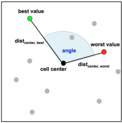

# Simple Cell Mapping Features

The idea behind cell mapping is that a continuous search space is partitioned in every dimension, thus achieving a discretization of the search space into cells.
This discretization of a sample into a number of cells, with several
points in each cell, opens up possibilities to measure global structure and multimodality of an optimization problem.

# Angle

The best and worst values within the cell might return some insight of the landscape. If they lie in opposite directions it indicates a trend within the cell. In that case the angle between the vectors from cell center to worst value and cell center to best value would be close to 180◦. Two features are obtained by aggregating the angles of all cells from the grid using the mean and the standard deviation.

Furthermore, the standard deviations in the lengths of the two vectors are used as additional features. In case of simple functions as the sphere function, the variation should be low as the majority of the cells have similar distances, because they usually lie close to the borders of the cells. In very multimodal functions, the variation should be high as cells with local optima result in contrary distances (short distances of the best values and long distances of the worst values) compared to cells without any local optima.

Since interactions between cells are ignored, i.e. these features are computed locally per cell, these features are independent from the search space dimensionality.

# Cell Convexity

Over all possible combinations of three neighbouring cells within the grid, the (weak or strong) concavity or convexity is computed. Per default, only horizontally and vertically neighbouring cells are considered. By passing `diag = TRUE` as a function parameter to `calculateCellConvexity`, diagonal neighbourhood is considered as well.

Given the function evaluations of three neighbouring cells, this feature is calculated by drawing a line between f(x1) and f(x3) and determining the placement of f(x2) in relation to this line. The figure below illustrates the resulting decision of whether a combination indicates convexity or concavity: Place the value of f(x2) above x2 and infer the corresponding decision.

# Gradient Homogeneity

For every point within a cell's sample, we find the nearest neighbor and compute the individual, normalized difference vector, which is always rotated so that it is pointing to the worse point. Then, we compute the length of the vector sum of the individual vectors amd divide it by the maximal possible vector length (equals the number of points due to normalization). For completely randomly distributed objective values, the fraction should be around 0 (vectors pointing in all directions), for a strong trend the values should approach 1.0 (all vectors point into the same direction).

From the individual values for each cell, we obtain two features by computing the mean and the standard deviation over all cells, taking only the homogeneity within each cell into account. Simple unimodal functions shall thus generate very high mean values.

Since interactions between cells are ignored, i.e. these features are computed locally per cell, these features are independent from the search space dimensionality.

# Literature Reference
Kerschke et al. (2014), "Cell Mapping Techniques for Exploratory Landscape Analysis", in EVOLVE-A Bridge between Probability, Set Oriented Numbers, and Evolutionary Computation V, pp. 151--131 ([http://dx.doi.org/10.1007/978-3-319-07494-8_9](http://dx.doi.org/10.1007/978-3-319-07494-8_9)).