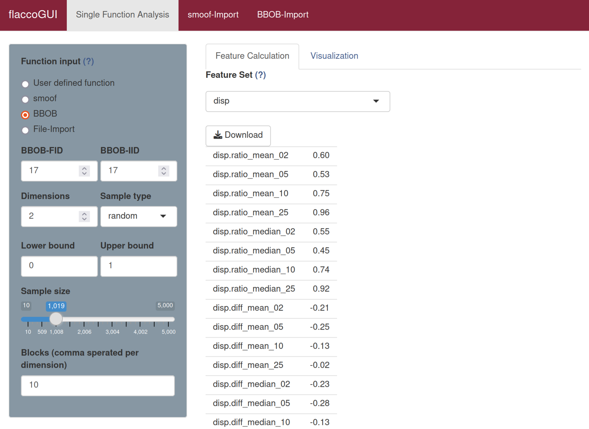

# Dispersion Features

The dispersion features compare the dispersion, i.e. the (aggregated) pairwise distances, of all points in the initial design with the dispersion among the best points in the initial design. Per default, this set of "best points" is based on the 2%, 5% and 10% quantile of the objectives.
Those dispersions are then compared based on the ratio as well as on the difference.

## Calculating Dispersion Features 

The dispersion features consist of the feature set `disp`. 

To calculate the `disp` features in **flacco** run the following code.

```{r}
library(flacco)

X = createInitialSample(n.obs = 5000, dim = 2)
fun = function(x) sum(x**2)

feat.object = createFeatureObject(X = X, fun = fun, blocks = 10)

calculateFeatureSet(
  feat.object = feat.object, 
  set = "disp"
)
```
For a complete overview of the features and their controll parameters, please refer to the documentation of `calculateFeatureSet`.

To calculate the `disp` features in **flaccoGUI** select "disp" under "Feature Set" as shown in the picture below.



## Literature Reference
Lunacek, M. and Whitley, D. (2014), "The Dispersion Metric and the CMA Evolution Strategy", in Proceedings of the 8th Annual Conference on Genetic and Evolutionary Computation, pp. 477--484, ACM ([http://dx.doi.org/10.1145/1143997.1144085](http://dx.doi.org/10.1145/1143997.1144085)).
