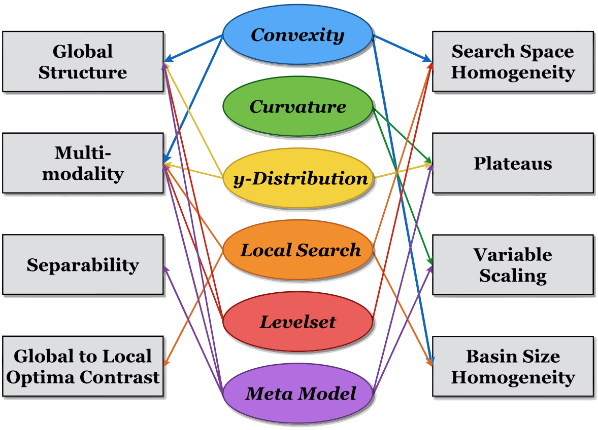

# Classical ELA Features

To be continued...

(Taken from Kerschke, P. et al., 2014)

# Literature Reference
Kerschke, P., Preuss, M., Hernandez, C., Schuetze, O., Sun, J.-Q., Grimme, C., Rudolph, G., Bischl, B., and Trautmann, H. (2014): "Cell Mapping Techniques for Exploratory Landscape Analysis", in: EVOLVE -- A Bridge between Probability, Set Oriented Numbers, and Evolutionary Computation V, pp. 151--131, Springer ([http://dx.doi.org/10.1007/978-3-319-07494-8_9](http://dx.doi.org/10.1007/978-3-319-07494-8_9)).

Mersmann et al. (2011), "Exploratory Landscape Analysis", in Proceedings of the 13th Annual Conference on Genetic and Evolutionary Computation, pp. 829--836. ACM ([http://dx.doi.org/10.1145/2001576.2001690](http://dx.doi.org/10.1145/2001576.2001690)).