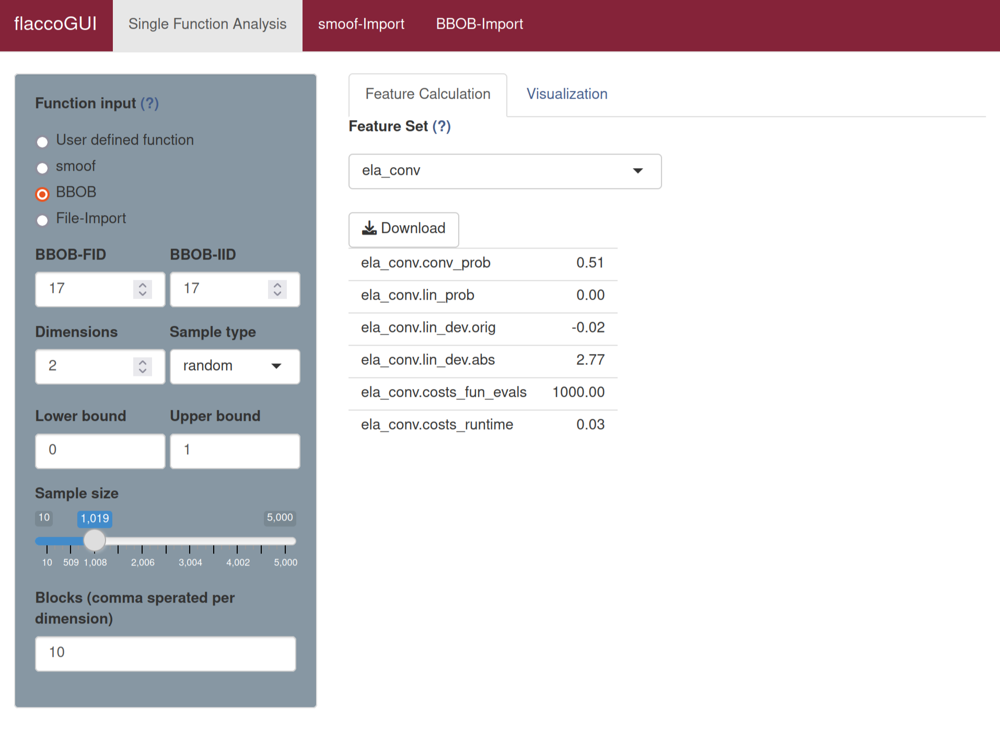

# Classical ELA Features

The term *Exploratory Landscape Analysis (ELA) features* (as introduced by Mersmann et al., 2011) summarizes a group of characteristics, which quantifies certain properties of a continuous optimization problem. In its original version, ELA covered a total of 50 features - grouped into six so-called *low-level properties* (Convexity, Curvature, y-Distribution, Levelset, Local Search and Meta Model). These (numerical values) were used to characterize (usually categorical and expert-designed) *high-level properties*, such as the *Global Structure*, *Multimodality* or *Variable Scaling*.
The figure below visualizes the connections between the low- and high-level properties.


(Inspired by Mersmann et al., 2011)

A detailed description of the features can be found in Mersmann et al. (2011).

## Calculating ELA Features 

The ELA features consist of the feature sets `ela_conv`, `ela_curv`, `ela_distr`, `ela_level`, `ela_local` and `ela_meta`. Note that `ela_conv`, `ela_curv` and `ela_local` require an exact function to be stored in the feature object as additional calculations need to be performed. 

To calculate the `ela_conv` features in **flacco** run the following code, for the other feature sets substitute `"ela_conv"` with the desired set.

```{r}
library(flacco)

X = createInitialSample(n.obs = 5000, dim = 2)
fun = function(x) sum(x**2)

feat.object = createFeatureObject(X = X, fun = fun, blocks = 10)

calculateFeatureSet(
  feat.object = feat.object, 
  set = "ela_conv"
)
```
For a complete overview of the features and their controll parameters, please refer to the documentation of `calculateFeatureSet`.

To calculate the `ela_conv` features in **flaccoGUI** select "ela_conv" under "Feature Set" as shown in the picture below, for the other feature sets choose the desired alternative from the dropdown menu.



## Literature Reference
Mersmann et al. (2011), "Exploratory Landscape Analysis", in Proceedings of the 13th Annual Conference on Genetic and Evolutionary Computation, pp. 829--836. ACM ([http://dx.doi.org/10.1145/2001576.2001690](http://dx.doi.org/10.1145/2001576.2001690)).

