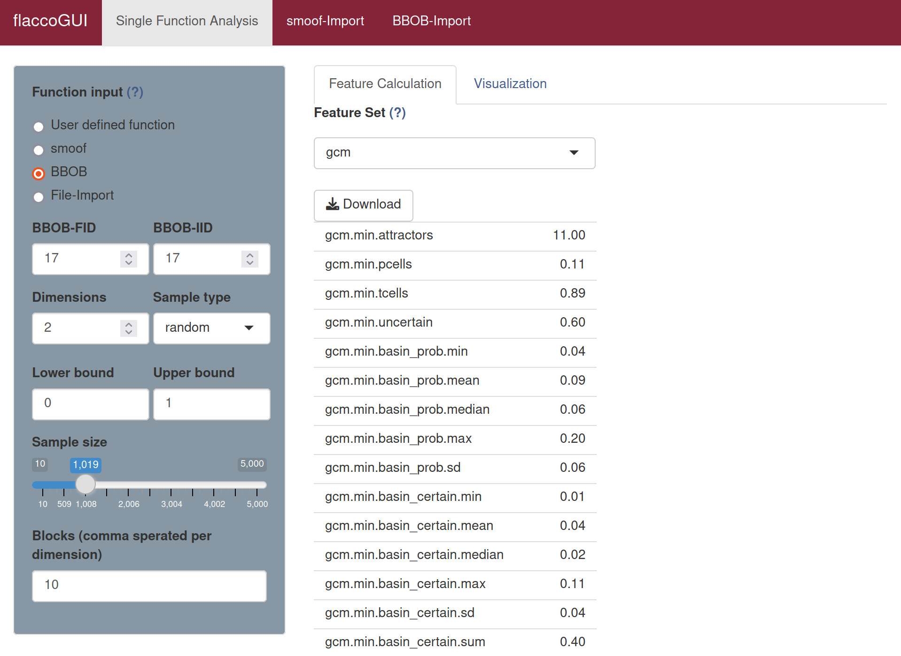

# Generalized Cell Mapping Features

*Generalized cell mapping (GCM)* discretizes the continuous search space in the same way, as described in the [previous section (Cell Mapping)](cm.md).

However, in contrast to the previous section, the GCM approach is based on transition probabilities between the cells and interprets them by making use of (absorbing) Markov chains.

For each cell, a representative objective function value is chosen. Consequently, the cell mapping abstracts from the original function evaluations and reduces the number of values to (at most) one per cell.

Three approaches are used for finding the representative value for each cell: minimum (`"min"`), average (`"mean"`), and nearest prototype (`"near"`). In the `"near"` approach, the representative value is the one that is closest to a cell's center. In the `"mean"` approach, all values that are located in one cell are averaged to create the representative value of that cell. For the `"min"` approach, the minimum of one cell's values is used as the representative value.

Note that in case of an empty cell, only the `"near"` approach is able to find a representative value for that cell.


## GCM Terms

**Attractor** / **Periodic cell**:

- a cell, which only leads to itself and thus absorbs transitions
- candidate for a local optima

**Transient cell**:

- a cell that is not periodic and therefore, the system will leave these cells with a given certainty (> 0)
- the terms below can be used to further classify transient cells

**Uncertain cell**:

- a cell, which leads to multiple attractors

**Basin**:

- a set of cells, which lead to the same attractor


## Calculating Generallized Cell Mapping Features 

The generalized cell mapping features consist of the feature set `gcm`.

To calculate the `gcm` features in **flacco** run the following code.

```{r}
library(flacco)

X = createInitialSample(n.obs = 5000, dim = 2)
fun = function(x) sum(x**2)

feat.object = createFeatureObject(X = X, fun = fun, blocks = 10)

calculateFeatureSet(
  feat.object = feat.object, 
  set = "gcm"
)
```
For a complete overview of the features and their controll parameters, please refer to the documentation of `calculateFeatureSet`.

To calculate the `gcm` features in **flaccoGUI** select "gcm" under "Feature Set" as shown in the picture below.



Also have a look into the [visualization](viz_cm.md) techniques that come with generalized cell mapping.

## Literature Reference
Kerschke, P., Preuss, M., Hernandez, C., Schuetze, O., Sun, J.-Q., Grimme, C., Rudolph, G., Bischl, B., and Trautmann, H. (2014): "Cell Mapping Techniques for Exploratory Landscape Analysis", in: EVOLVE -- A Bridge between Probability, Set Oriented Numbers, and Evolutionary Computation V, pp. 151--131, Springer ([http://dx.doi.org/10.1007/978-3-319-07494-8_9](http://dx.doi.org/10.1007/978-3-319-07494-8_9)).
