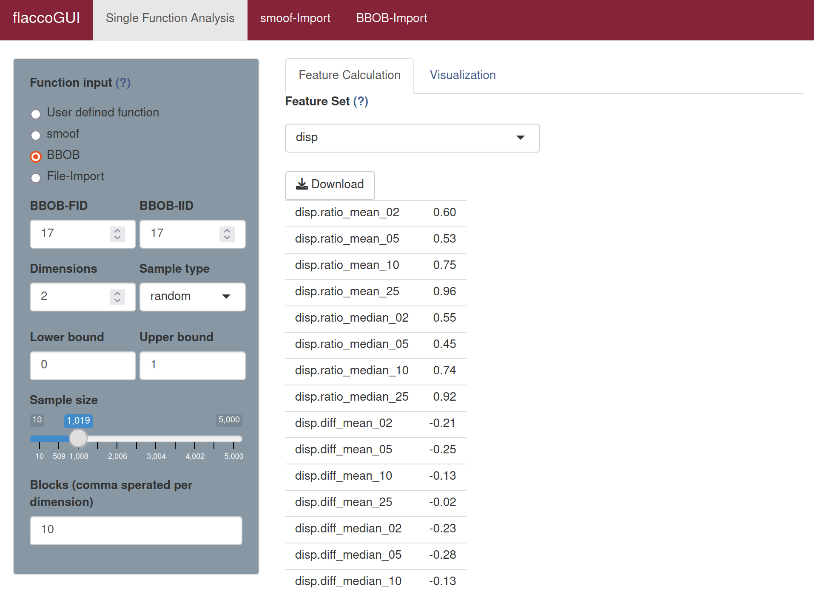

# Information Content-Based Features

In the Information Content of Fitness Sequences (ICoFiS) approach, the information content of a continuous landscape, i.e. smoothness, ruggedness, or neutrality, are quantified.

While common analysis methods were able to calculate the information content of discrete landscapes, the ICoFiS approach provides an adaptation to continuous landscapes that accounts e.g. for variable step sizes in random walk sampling.

This method quantifies the changes in fitness between neighbours while accounting for the distance between two neighbours in the continuous space. Abstracting from the actual values of change, the landscape is transformed into a symbol sequence, indicating whether a positive, negative, or neutral change was performed between to values.

Afterwards, every two consecutive symbols compose a block in the fitness landscape. The *information content* is then derived from the observed probabilities of all blocks that are composed of two different symbols (e.g., a change from positive to negative or from neutral to positive).

As a further measure, the *partial information content* is proposed. It is calculated from a modified symbol sequence that omits any neutral changes and repeated symbols. However, the authors (see below) state that the partial information content does not yield much additional information for the increased calculation complexity.

## Calculating Information Content-Based Features 

The information content-based features consist of the feature set `ic`. 

To calculate the `ic` features in **flacco** run the following code.

```{r}
library(flacco)

X = createInitialSample(n.obs = 5000, dim = 2)
fun = function(x) sum(x**2)

feat.object = createFeatureObject(X = X, fun = fun, blocks = 10)

calculateFeatureSet(
  feat.object = feat.object, 
  set = "ic"
)
```
For a complete overview of the features and their controll parameters, please refer to the documentation of `calculateFeatureSet`.

To calculate the `ic` features in **flaccoGUI** select "ic" under "Feature Set" as shown in the picture below.



Also have a look into the [visualization](viz_ic.md) techniques that come with the infomation content-based features.


## Literature Reference
Mu&ntilde;oz, M. et al. (2015), "Exploratory Landscape Analysis of Continuous Space Optimization Problems Using Information Content", in IEEE Transactions on Evolutionary Computation (19:1), pp. 74--87 ([http://dx.doi.org/10.1109/TEVC.2014.2302006](http://dx.doi.org/10.1109/TEVC.2014.2302006)).
