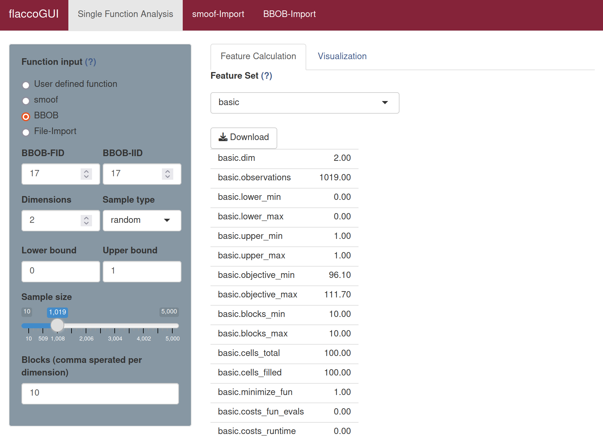

# Basic Features

This feature set is a collection of very basic features, such as the dimension and the boundaries of the initial design.

# Principal Components Features

The features of this group try to describe the variable scaling of a continuous problem. This is done by applying a *Principal Component Analysis* (either based on the covariance or the correlation matrix) to the data. Here, "data" can either be the entire initial design or just the decision space (i.e. the initial design without the objective).
Based on these four approaches, the features describe the (relative) amount of principal components that are required to explain a certain amount of variability (the default is 0.9) of the problem. The higher the ratio is, the more principal components are required.
Apart from those features, the importance of the first principal component is measured as well.

## Calculating Basic and Principal Component Features 

The basic and principal component features consist of the feature sets `basic` and `pca`. 

To calculate the `basic` features in **flacco** run the following code, for the principal component substitute `"basic"` with `"pca"`.

```{r}
library(flacco)

X = createInitialSample(n.obs = 5000, dim = 2)
fun = function(x) sum(x**2)

feat.object = createFeatureObject(X = X, fun = fun, blocks = 10)

calculateFeatureSet(
  feat.object = feat.object, 
  set = "basic"
)
```
For a complete overview of the features and their controll parameters, please refer to the documentation of `calculateFeatureSet`.

To calculate the `basic` features in **flaccoGUI** select "basic" under "Feature Set" as shown in the picture below, for the pricipal component feature set choose "pca" from the dropdown menu.



