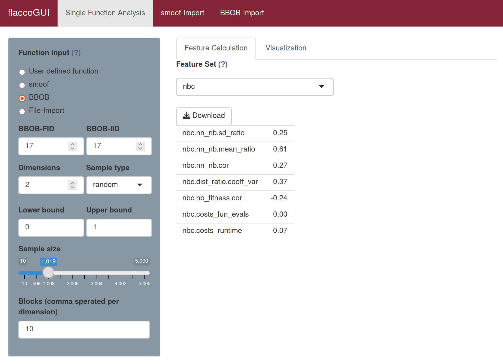

# Nearest Better Features

The *Nearest-Better Features* -- sometimes also called *Nearest-Better Clustering (NBC) Features* -- are based on a heuristic, which recognizes single peaks in a multimodal landscape.

In general, the features are computed on two sets of distances: the distances from each point to its *nearest neighbor* and the distances from each point to its *nearest-better neighbor*. Here, the latter one is the closest observation (w.r.t. the reference point) with a better objective value than the reference point.

Based on these two distance sets, this feature set computes five NBC features. A further motivation of these features can be found, amongst others, in Kerschke et al. (2015).


## Calculating Nearest Better Features 

The nearest better features consist of the feature set `nbc`. 

To calculate the `nbc` features in **flacco** run the following code.

```{r}
library(flacco)

X = createInitialSample(n.obs = 5000, dim = 2)
fun = function(x) sum(x**2)

feat.object = createFeatureObject(X = X, fun = fun, blocks = 10)

calculateFeatureSet(
  feat.object = feat.object, 
  set = "nbc"
)
```
For a complete overview of the features and their controll parameters, please refer to the documentation of `calculateFeatureSet`.

To calculate the `nbc` features in **flaccoGUI** select "nbc" under "Feature Set" as shown in the picture below.



## Literature Reference
Preuss, M. (2012), "Improved Topological Niching for Real-Valued Global Optimization", in Applications of Evolutionary Computation, pp. 386--395, Springer ([http://dx.doi.org/10.1007/978-3-642-29178-4_39](http://dx.doi.org/10.1007/978-3-642-29178-4_39)).

Kerschke, P. et al. (2015), "Detecting Funnel Structures by Means of Exploratory Landscape Analysis", in Proceedings of the 17th Annual Conference on Genetic and Evolutionary Computation (GECCO '15), pp. 265-272, ACM ([http://dx.doi.org/10.1145/2739480.2754642](http://dx.doi.org/10.1145/2739480.2754642)).
