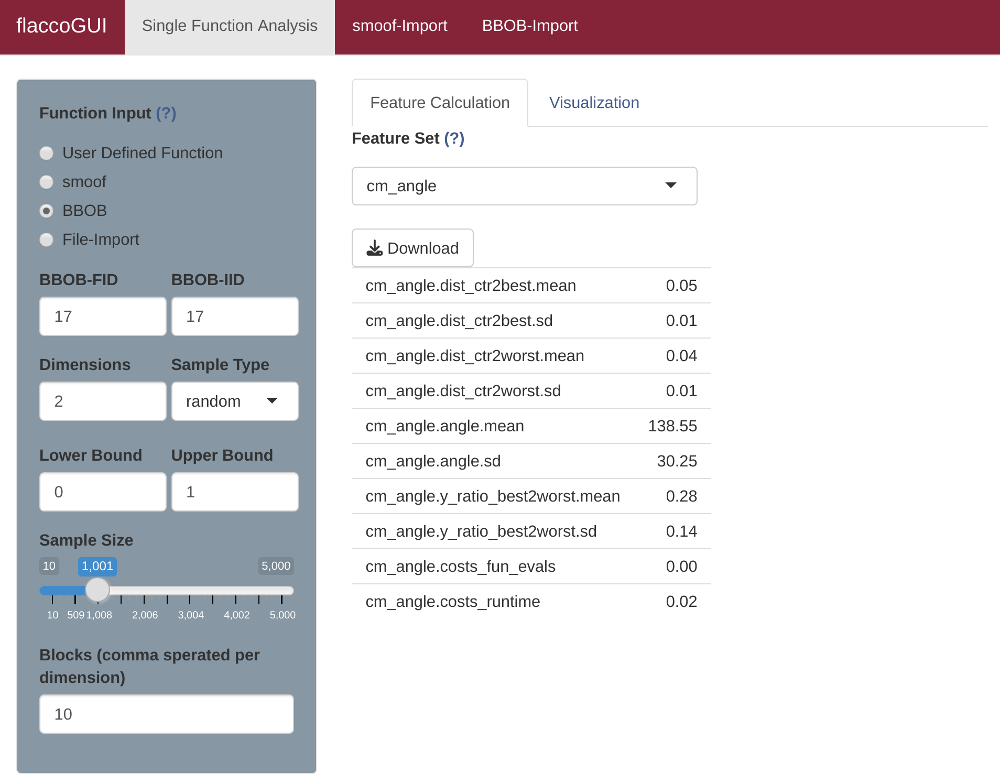
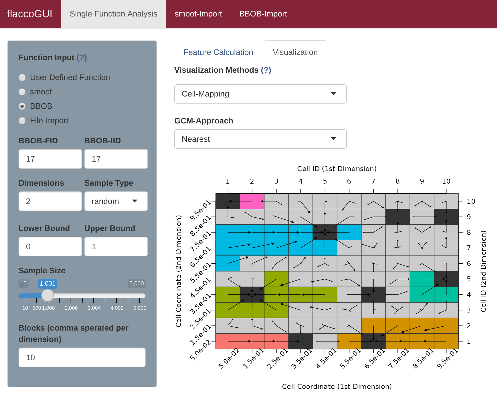
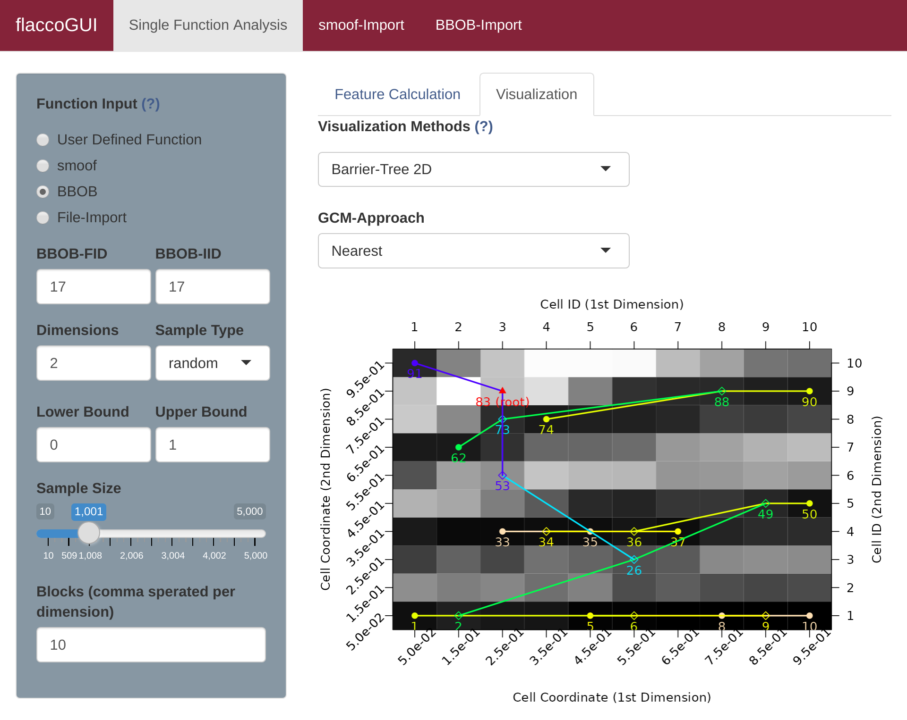
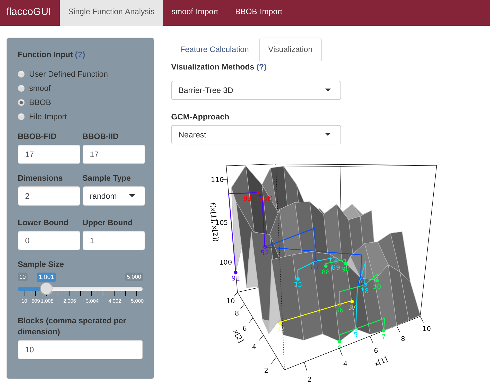
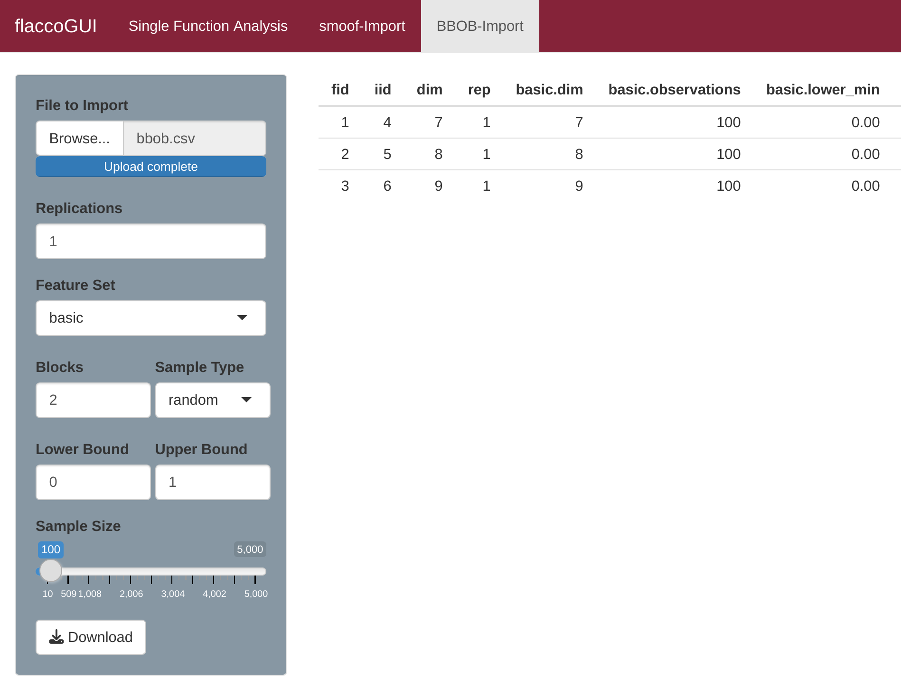
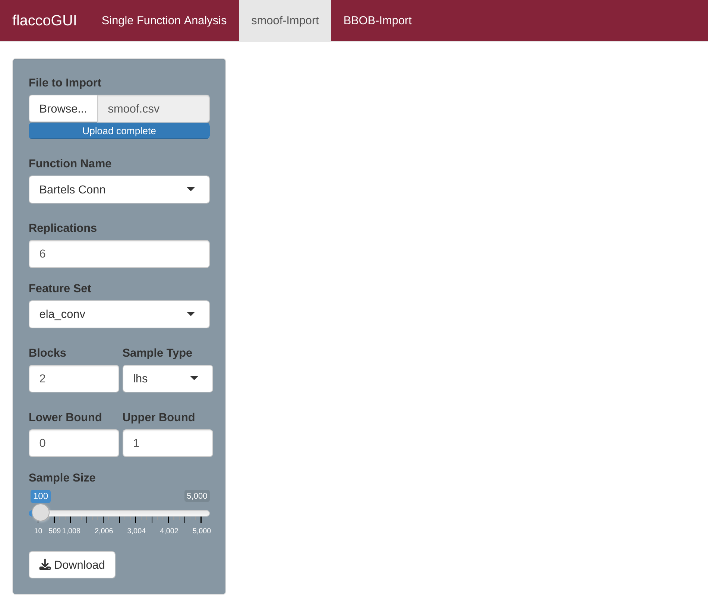

## Using **flaccoGUI**

Conveniently for users that are not familiar with R **flacco** comes with a graphical user interface. To use the **flaccoGUI** the user has different options. The easiest option is to use the hosted version of **flaccoGUI** at [shinyapps.io](https://flacco.shinyapps.io/flacco/). In that case, the user does not need to install any other software but just needs to open the web page and perform the landscape analysis online. If one prefers to run the application locally on ones own machine, one can do so by executing the following R-code snippet:

```{R}
# first, install the "flacco"-package and its dependencies from CRAN

install.packages("flacco", dependencies = TRUE)

# then, load the package and start the app

library(flacco)
runFlaccoGUI()
```

## Function Input

When using the **flaccoGUI** one has to provide a sample of function evaluations on which the landscape features can be calculated. The **flaccoGUI** provides four options here. For demonstration purposes BBOB will be used to show how to calculate the features and visualize them in the following sections. After this a it will be shown how to apply a user defined function, smoof and a file-import.

In order to choose a BBOB function one has to select the tab "Single Function Analysis" and in the left hand panel under "Function input" choose "BBOB". The user has to provide a function ID (BBOB-FID), instance ID (BBOB-IID) as well as the dimension, sample type, lower and upper bound aswell as a the sample size. and the amount of blocks.

## Calculate Features


The feature sets can then be obtained by selecting "Feature Calculation" in the right hand panel and under "Feature Set" selecting the appropriate set. The resulting features can then be downloaded as a CSV-file for further use via the "Downlaod" button. 



Note that while many feature sets can be calcuated based on the sample of function evaluations other features (namely ELA convexity "ela_conv", ELA curvature "ela_curv" and ELA local search "ela_local") need to perform further function evaluations in order to compute the features. This is no problem for the BBOB, smoof and user defined function as these come with the underlying function, but it will be for samples that are improted as a file. One can simply obtain all feature sets by selecting the "Feature Set" "all Features" under the aforementioned restriction on a two dimensional sample.

## Creating Explanatory Plots

In addition to the features, the GUI provides plots, which visualize the features (or intermediate steps, which lead to the features). For example, the mechanics behind the [generalized cell mapping approach](gcm.md) are sometimes hard to grasp. In those cases, a plot, which visualizes the (two-dimensional) grid and indicates the transition probabilities from any cell to its attractor using proportional arrows, could be helpful. Such a plot can be created by selecting "Visualization" in the right hand panel and there "Cell-Mapping" as the visualization method.

[//]: # (number steps in pic and text)


Similarly, the [Barrier Tree](barriertrees.md) usually become more clear, when visualizing them. **flaccoGUI** allows its users to create 2D and 3D barrier trees. The former one look similar to the aforementioned cellmappings - extended by the branches of the tree. Please note, that the barrier tree features currently only work for problems with a 2D decision space.





## Other Input Types

[//]: # (Use smoof (dim), user defined (eg sum(x**2)), file import (.csv - should have 3 columns (x, y)) 

Other than BBOB one can choose to analyze the landscape features of the "smoof" functions. For this one can choose smoof under "Function input" and specify the desired function as well as dimensions. For simple mathematical functions select "User defined function" and enter a mathematical expression (e.g. `x**2`). Lastly one can import a CSV-file that is containing the target variable in its last column.

## BBOB-Import

[//]: # (bbob import) 

If one wants to calculate the landscape features of multiple BBOB examples simulatneously one can simply open the tab "BBOB-Import" and upload a CSV-file containing information on the fid, iid and dimension of the desired examples.



## smoof-Import

[//]: # (smoof import) 

To evaluate a smoof-function across different dimensions at the same time, go to the "smoof-Import" tab and upload a CSV-file containing all the desired dimensions.




[//]: # () 
[//]: # () 


