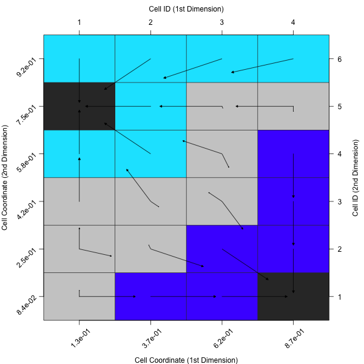

# Visualisations
In addition to the features themselves, **flacco** provides tools for visualizing the results. This way, one can visualize the *Cell Mapping* of a feature object, draw the corresponding *Barrier Trees* or plot the *Information Content*.
In addition, the so-called *Feature Importance Plot* might be useful when analyzing the influence of each feature, e.g. after a feature selection.

Be aware of the fact that all plots related to *Cell Mapping* (i.e. `plotCellMapping`, `plotBarrierTree2D` and `plotBarrierTree3D`) can only be executed on 2-dimensional problems!

## Cell Mapping
As introduced in the chapters [Cell Mapping](cm.md) and [Generalized Cell Mapping](gcm.md), the idea of *cell mapping* is to partition a continuous decision space into a grid of cells and compute features based on this discrete set of observations.
In order to get a better understanding of this approach, one should visualize the resulting mappings. This can be done by applying `plotCellMapping` to a *feature object*.

```{r}
# Create a Feature Object
set.seed(12)
X = createInitialSample(n.obs = 1000, dim = 2)
f = smoof::makeBBOBFunction(2, 15, 1)
feat.object = createFeatureObject(X = X, fun = f, blocks = c(4, 6))

# Plot the (default) Cell Mapping
plotCellMapping(feat.object)
``` 

Per default, this will create a cell mapping which uses the minimum of all observations as prototype (per cell).


In case one rather prefers the average of all observations within a cell or the nearest prototype of a cell, one can adapt the plot accordingly.

```{r}
plotCellMapping(feat.object, control = list(gcm.approach = "mean"))
```



```{r}
plotCellMapping(feat.object, control = list(gcm.approach = "near"))
```


A complete overview of the control arguments of the cell mapping plots can be found in the documentation of `plotCellMapping`.

## Barrier Trees

As mentioned in the [Barrier Trees](barriertrees.md) chapter, the barrier trees build on top the cell mapping. They represent the local minima (i.e. the attractor cells) as leaves of a tree. Two (or sometimes more) leaves are connected at a *saddle point*. Those points have to be passed in order to get from one minima to another one -- thus, they are a barrier between them.

### Barrier Trees 2D

In its simplest version, barrier trees can be seen as an additional layer on top of a cell mapping. Let's just create the barrier tree using `plotBarrierTree2D`, which builds a *barrier tree* on top of the most recent cell mapping -- i.e. the one, which is based on the nearest prototype approach.

```{r}
plotBarrierTree2D(feat.object, control = list(gcm.approach = "near"))
```


If the colors of the cell mapping are misleading - or just not satisfying - one can also turn off the cell mapping background and use a grey scale instead. In that case cells with lighter colors correspond to observations with higher objective values (and vice versa).

```{r}
plotBarrierTree2D(feat.object, control = list(gcm.approach = "near", bt.cm_surface = FALSE))
```


### Barrier Trees 3D

In case one prefers to visualize the *barrier trees* in three dimensions, one can simply use `plotBarrierTree3D` as the following example shows.

```{r}
plotBarrierTree3D(feat.object, control = list(gcm.approach = "near"))
```


Again, there exist many alternative control arguments, which one might want to define.

```{r}
ctrl = list(gcm.approach = "near", bt.color_surface = "lightblue",
  bt.persp_theta = 135, bt.persp_phi = 35)
plotBarrierTree3D(feat.object, control = ctrl)
```


A complete overview of the control arguments of the barrier tree plots can be found in the documentations of `plotBarrierTree2D` and `plotBarrierTree3D`.

## Information Content

The [Information Content](ic.md) approach quantifies the *information content* of a continuous landscape - i.e. its smoothness, ruggedness, or neutrality - by measuring the changes of the fitness between neighbours (while still accounting for the distance between two neighbours in the continuous space). This is done by travelling from point to point within the landscape and transforming the actual differences into a symbol sequence of positive, negative, or neutral changes.

This behaviour can also been visualized with a diagnostic plot, using the function `plotInformationContent`. The default version creates a plot, similar to the one shown in Mu&ntilde;oz et al. (2015).

```{r}
plotInformationContent(feat.object)
```


Similar to the previous visualizations, it is possible to customize the plot using the control parameters.

```{r}
par(mfrow = c(1, 1), mar = c(4, 4, 1, 1))
ctrl = list(ic.info_sensitivity = 0.3, ic.plot.max_ic.lwd = 4, ic.plot.partial_ic.lwd = 3)
plotInformationContent(feat.object, control = ctrl)
```

A complete overview of the possible control arguments can be found in the documentation of `plotInformationContent`.


## Feature Importance Plot

The last visualisation technique differs from the remaining plots in a way that it is not directly related to any feature sets. Instead, it is a helpful tool for assessing the influence of a feature based on a nested resampling strategy.

Let's assume one has a data set, which consists of quite a few features. Then, one would likely want to reduce that amount of features, e.g. by performing a feature selection. In the course of that feature selection, one will likely evaluate the found feature set, using a resample strategy, such as a 10-fold cross validation. Now, the model might not use all features in each of the 10 folds. Instead, feature A might only occur 2-3 times, whereas feature B will be considered 9 times. Then, feature B seems to be of higher importance for the model. Such an analysis can be done using the provided function -- `plotFeatureImportance`.

```{r}
# At the beginning, one needs a list of features, e.g. derived during a
# nested feature selection within mlr (see the following 8 steps):
library(mlr)
library(mlbench)
data(Glass)

# (1) Create a classification task:
classifTask = makeClassifTask(data = Glass, target = "Type")

# (2) Define the model (here, a classification tree):
lrn = makeLearner(cl = "classif.rpart")

# (3) Define the resampling strategy, which is supposed to be used within 
# each inner loop of the nested feature selection:
innerResampling = makeResampleDesc("Holdout")

# (4) What kind of feature selection approach should be used? Here, we use a
# sequential backward strategy, i.e. starting from a model with all features,
# in each step the feature decreasing the performance measure the least is
# removed from the model:
ctrl = makeFeatSelControlSequential(method = "sbs")

# (5) Wrap the original model (see (2)) in order to allow feature selection:
wrappedLearner = makeFeatSelWrapper(learner = lrn,
  resampling = innerResampling, control = ctrl)

# (6) Define a resampling strategy for the outer loop. This is necessary in
# order to assess whether the selected features depend on the underlying
# fold:
outerResampling = makeResampleDesc(method = "CV", iters = 10L)

# (7) Perform the feature selection:
featselResult = resample(learner = wrappedLearner, task = classifTask,
  resampling = outerResampling, models = TRUE)

# (8) Extract the features, which were selected during each iteration of the
# outer loop (i.e. during each of the 5 folds of the cross-validation):
featureList = lapply(featselResult$models, 
  function(mod) getFeatSelResult(mod)$x)
  
# Now, one can visualise the results:
plotFeatureImportance(featureList)
```


Analoguous to the previous plotting functions, this function also allows to customize the output. For instance, one can rotate the angle of the labels on the x-axis or use a different symbol for the inactive features.

```{r}
ctrl = list(featimp.string_angle = 20, featimp.pch_inactive = 8)
plotFeatureImportance(featureList, control = ctrl)
```


A complete overview of all possible control arguments can be found in the documentation of `plotFeatureImportance`.

## Literature Reference
Flamm, C. et al. (2012), "Barrier Trees of Degenerate Landscapes", in Z. Phys. Chem. (216:2), pp. 155--173 ([http://dx.doi.org/10.1524/zpch.2002.216.2.155](http://dx.doi.org/10.1524/zpch.2002.216.2.155)).

Kerschke, P., Preuss, M., Hernandez, C., Schuetze, O., Sun, J.-Q., Grimme, C., Rudolph, G., Bischl, B., and Trautmann, H. (2014): "Cell Mapping Techniques for Exploratory Landscape Analysis", in: EVOLVE -- A Bridge between Probability, Set Oriented Numbers, and Evolutionary Computation V, pp. 151--131, Springer ([http://dx.doi.org/10.1007/978-3-319-07494-8_9](http://dx.doi.org/10.1007/978-3-319-07494-8_9)).

Mu&ntilde;oz, M. et al. (2015), "Exploratory Landscape Analysis of Continuous Space Optimization Problems Using Information Content", in IEEE Transactions on Evolutionary Computation (19:1), pp. 74--87 ([http://dx.doi.org/10.1109/TEVC.2014.2302006](http://dx.doi.org/10.1109/TEVC.2014.2302006)).
