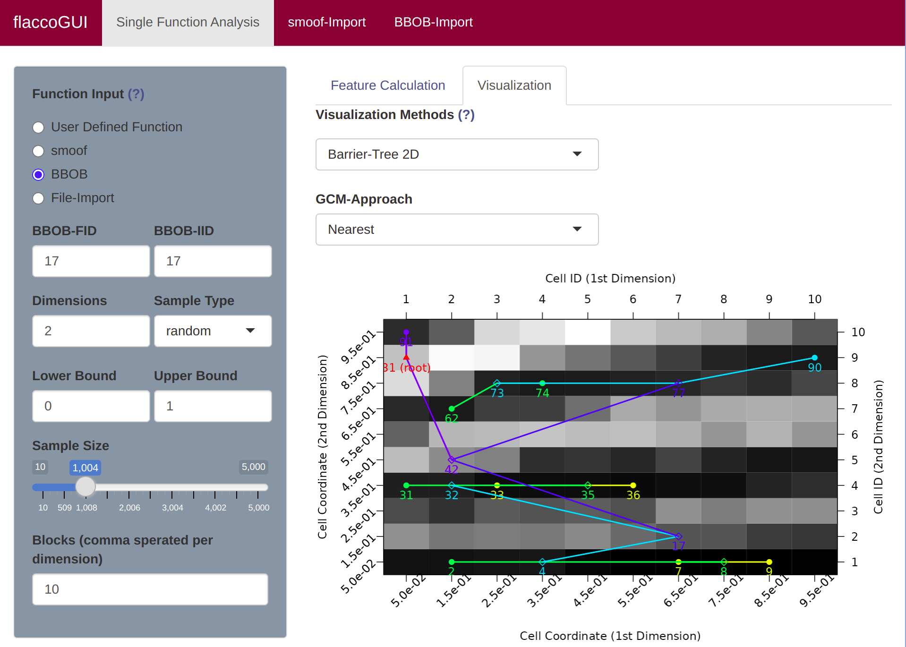
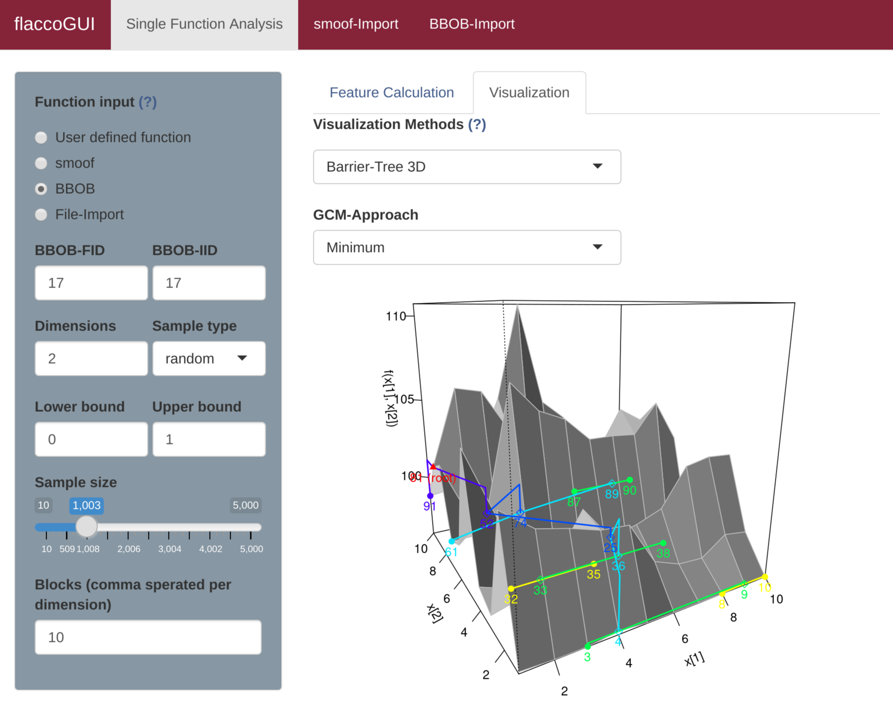

## Barrier Trees

As mentioned in the [Barrier Trees](barriertrees.md) chapter, the barrier trees build on top the [cell mapping](cm.md). They represent the local minima (i.e. the attractor cells) as leaves of a tree. Two (or sometimes multiple) leaves are connected at a *saddle point*. Those points have to be passed in order to get from one minima to another one -- thus, they are a barrier between them.

### Barrier Trees 2D

In its simplest version, barrier trees can be seen as an additional layer on top of a cell mapping. Let's just create the barrier tree using `plotBarrierTree2D`, which builds a *barrier tree* on top of the most recent cell mapping -- i.e. the one, which is based on the nearest prototype approach.

```{r}
library(flacco)

set.seed(12)
X = createInitialSample(n.obs = 1000, dim = 2)
f = smoof::makeBBOBFunction(2, 15, 1)
feat.object = createFeatureObject(X = X, fun = f, blocks = c(4, 6))

plotBarrierTree2D(feat.object, control = list(gcm.approach = "near"))
```


If the colors of the cell mapping are misleading - or just not satisfying - one can also turn off the cell mapping background and use a grey scale instead. In that case cells with lighter colors correspond to observations with higher objective values (and vice versa).

```{r}
plotBarrierTree2D(feat.object, control = list(gcm.approach = "near", bt.cm_surface = FALSE))
```


To visualize the 2D barrier tree in flaccoGUI select "Barrier-Tree 2D" under Visualization Methods as shown in the picture below.



### Barrier Trees 3D

In case one prefers to visualize the *barrier trees* in three dimensions, one can simply use `plotBarrierTree3D` as the following example shows.

```{r}
plotBarrierTree3D(feat.object, control = list(gcm.approach = "near"))
```


Again, there exist many alternative control arguments, which one might want to define.

```{r}
ctrl = list(gcm.approach = "near", bt.color_surface = "lightblue",
  bt.persp_theta = 135, bt.persp_phi = 35)
plotBarrierTree3D(feat.object, control = ctrl)
```


A complete overview of the control arguments of the barrier tree plots can be found in the documentations of `plotBarrierTree2D` and `plotBarrierTree3D`.

To visualize the 3D barrier tree in flaccoGUI select "Barrier-Tree 3D" under Visualization Methods as shown in the picture below.



## Literature Reference
Flamm, C. et al. (2012), "Barrier Trees of Degenerate Landscapes", in Z. Phys. Chem. (216:2), pp. 155--173 ([http://dx.doi.org/10.1524/zpch.2002.216.2.155](http://dx.doi.org/10.1524/zpch.2002.216.2.155)).
