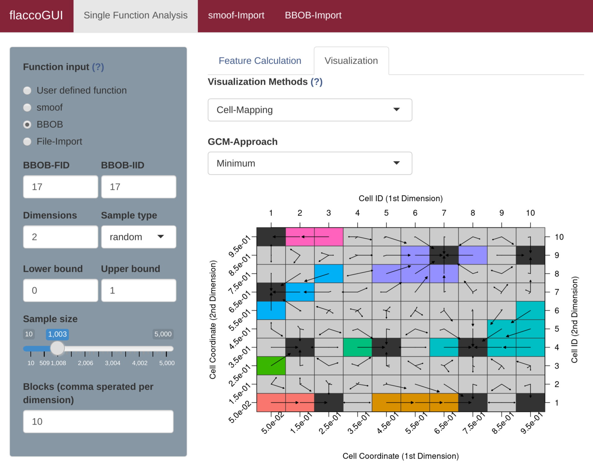

## Cell Mapping
As introduced in the chapters [Cell Mapping](cm.md) and [Generalized Cell Mapping](gcm.md), the idea of *cell mapping* is to partition a continuous decision space into a grid of cells and compute features based on this discrete set of observations.
In order to get a better understanding of this approach, one should visualize the resulting mappings. This can be done by applying `plotCellMapping` to a *feature object*.

```{r}
library(flacco)

set.seed(12)
X = createInitialSample(n.obs = 1000, dim = 2)
f = smoof::makeBBOBFunction(2, 15, 1)
feat.object = createFeatureObject(X = X, fun = f, blocks = c(4, 6))

plotCellMapping(feat.object)
```

Per default, this will create a cell mapping which uses the minimum of all observations as prototype (per cell).


In case one rather prefers the average of all observations within a cell or the nearest prototype of a cell, one can adapt the plot accordingly.

```{r}
plotCellMapping(feat.object, control = list(gcm.approach = "mean"))
```


```{r}
plotCellMapping(feat.object, control = list(gcm.approach = "near"))
```


A complete overview of the control arguments of the cell mapping plots can be found in the documentation of `plotCellMapping`.

To visualize cell mapping in flaccoGUI select "Cell-Mapping" under Visualization Methods as shown in the picture below.



## Literature Reference

Kerschke, P., Preuss, M., Hernandez, C., Schuetze, O., Sun, J.-Q., Grimme, C., Rudolph, G., Bischl, B., and Trautmann, H. (2014): "Cell Mapping Techniques for Exploratory Landscape Analysis", in: EVOLVE -- A Bridge between Probability, Set Oriented Numbers, and Evolutionary Computation V, pp. 151--131, Springer ([http://dx.doi.org/10.1007/978-3-319-07494-8_9](http://dx.doi.org/10.1007/978-3-319-07494-8_9)).
