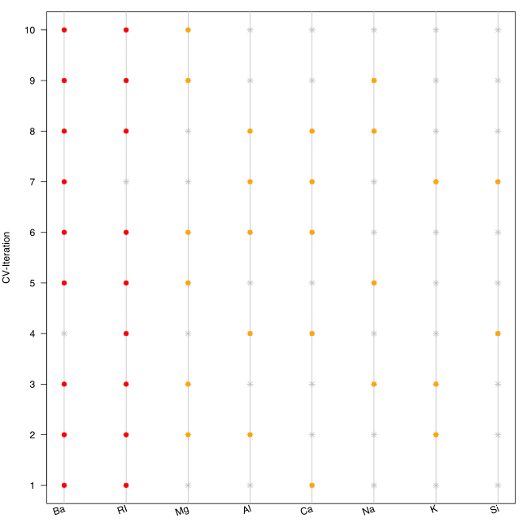

## Feature Importance Plot

The last visualisation technique differs from the remaining plots in a way that it is not directly related to any feature sets. Instead, it is a helpful tool for assessing the influence of a feature based on a nested resampling strategy.

Let's assume one has a data set, which consists of quite a few features. Then, one would likely want to reduce that amount of features, e.g. by performing a feature selection. In the course of that feature selection, one will likely evaluate the found feature set, using a resample strategy, such as a 10-fold cross validation. Now, the model might not use all features in each of the 10 folds. Instead, feature A might only occur 2-3 times, whereas feature B will be considered 9 times. Then, feature B seems to be of higher importance for the model. Such an analysis can be done using the provided function -- `plotFeatureImportance`.

```{r}
# At the beginning, one needs a list of features, e.g. derived during a
# nested feature selection within mlr (see the following 8 steps):
library(mlr)
library(mlbench)
data(Glass)

# (1) Create a classification task:
classifTask = makeClassifTask(data = Glass, target = "Type")

# (2) Define the model (here, a classification tree):
lrn = makeLearner(cl = "classif.rpart")

# (3) Define the resampling strategy, which is supposed to be used within 
# each inner loop of the nested feature selection:
innerResampling = makeResampleDesc("Holdout")

# (4) What kind of feature selection approach should be used? Here, we use a
# sequential backward strategy, i.e. starting from a model with all features,
# in each step the feature decreasing the performance measure the least is
# removed from the model:
ctrl = makeFeatSelControlSequential(method = "sbs")

# (5) Wrap the original model (see (2)) in order to allow feature selection:
wrappedLearner = makeFeatSelWrapper(learner = lrn,
  resampling = innerResampling, control = ctrl)

# (6) Define a resampling strategy for the outer loop. This is necessary in
# order to assess whether the selected features depend on the underlying
# fold:
outerResampling = makeResampleDesc(method = "CV", iters = 10L)

# (7) Perform the feature selection:
featselResult = resample(learner = wrappedLearner, task = classifTask,
  resampling = outerResampling, models = TRUE)

# (8) Extract the features, which were selected during each iteration of the
# outer loop (i.e. during each of the 5 folds of the cross-validation):
featureList = lapply(featselResult$models, 
  function(mod) getFeatSelResult(mod)$x)
  
# Now, one can visualise the results:
plotFeatureImportance(featureList)
```


Analoguous to the previous plotting functions, this function also allows to customize the output. For instance, one can rotate the angle of the labels on the x-axis or use a different symbol for the inactive features.

```{r}
ctrl = list(featimp.string_angle = 20, featimp.pch_inactive = 8)
plotFeatureImportance(featureList, control = ctrl)
```


A complete overview of all possible control arguments can be found in the documentation of `plotFeatureImportance`.
