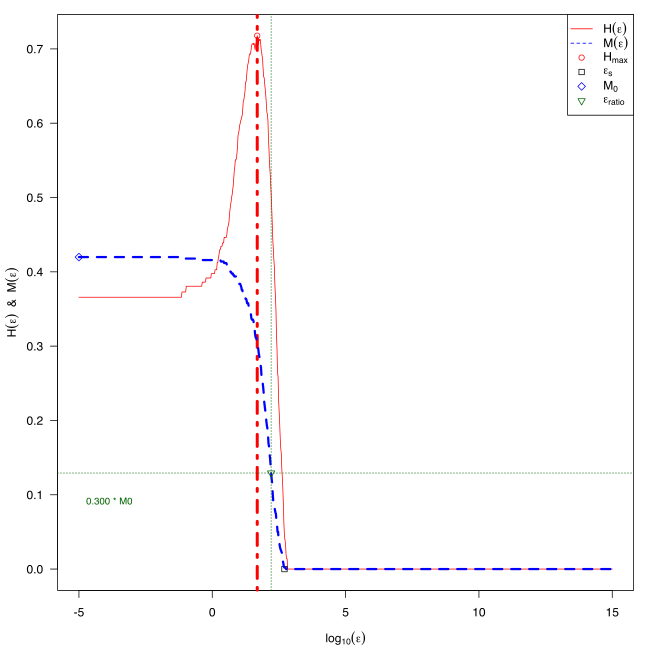
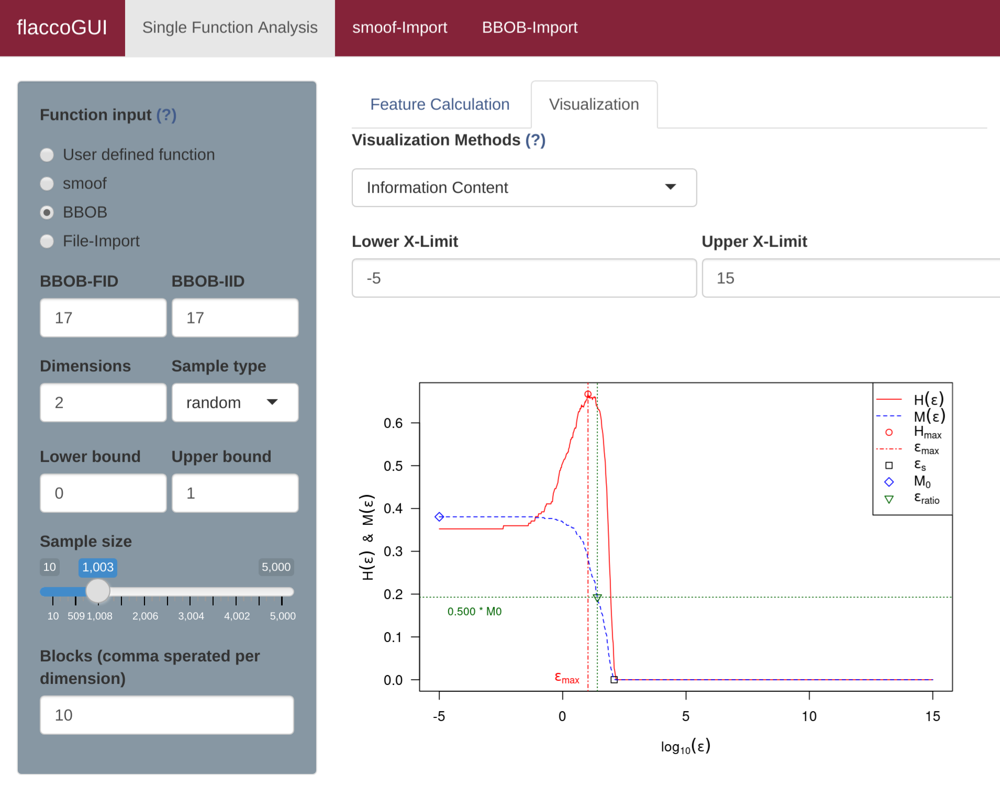

## Information Content

The [Information Content](ic.md) approach quantifies the *information content* of a continuous landscape - i.e. its smoothness, ruggedness, or neutrality - by measuring the changes of the fitness between neighbours (while still accounting for the distance between two neighbours in the continuous space). This is done by travelling from point to point within the landscape and transforming the actual differences into a symbol sequence of positive, negative, or neutral changes.

This behaviour can also been visualized with a diagnostic plot, using the function `plotInformationContent`. The default version creates a plot, similar to the one shown in Mu&ntilde;oz et al. (2015).

```{r}
library(flacco)

set.seed(12)
X = createInitialSample(n.obs = 1000, dim = 2)
f = smoof::makeBBOBFunction(2, 15, 1)
feat.object = createFeatureObject(X = X, fun = f, blocks = c(4, 6))

plotInformationContent(feat.object)
```


Similar to the previous visualizations, it is possible to customize the plot using the control parameters.

```{r}
par(mfrow = c(1, 1), mar = c(4, 4, 1, 1))
ctrl = list(ic.info_sensitivity = 0.3, ic.plot.max_ic.lwd = 4, ic.plot.partial_ic.lwd = 3)
plotInformationContent(feat.object, control = ctrl)
```

A complete overview of the possible control arguments can be found in the documentation of `plotInformationContent`.




To visualize the information content in flaccoGUI select "Information Content" under Visualization Methods as shown in the picture below.



## Literature Reference
Mu&ntilde;oz, M. et al. (2015), "Exploratory Landscape Analysis of Continuous Space Optimization Problems Using Information Content", in IEEE Transactions on Evolutionary Computation (19:1), pp. 74--87 ([http://dx.doi.org/10.1109/TEVC.2014.2302006](http://dx.doi.org/10.1109/TEVC.2014.2302006)).
